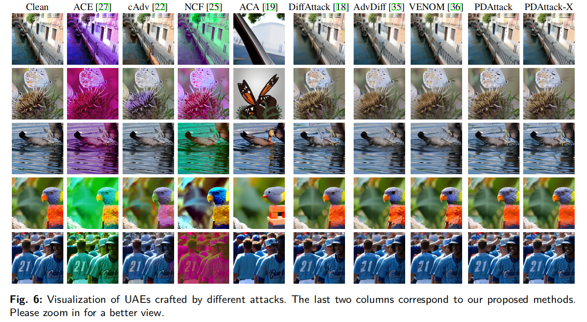
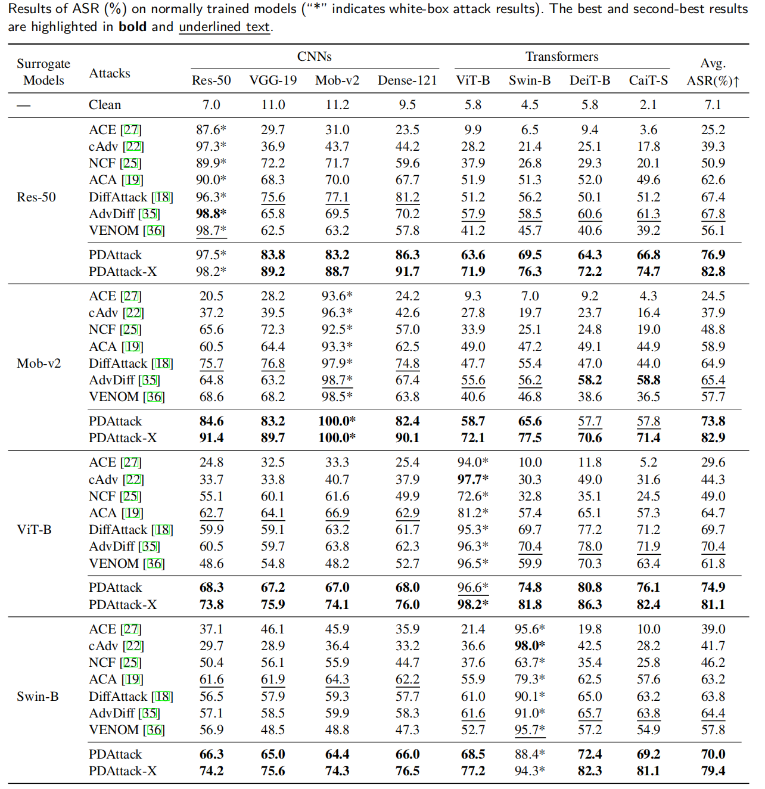
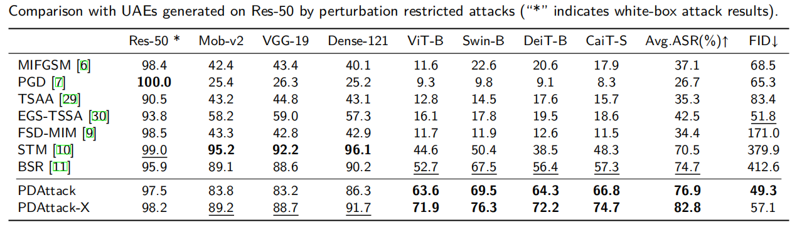
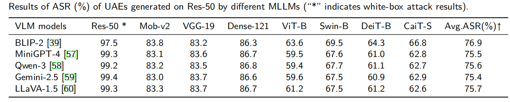
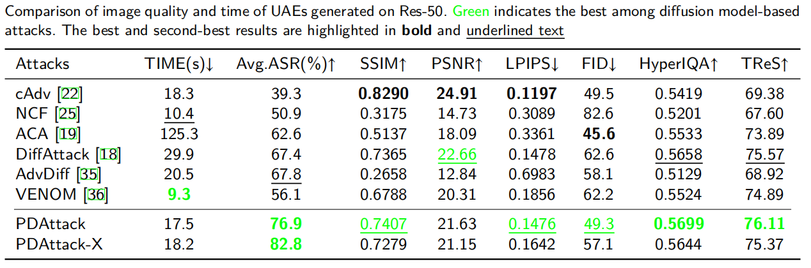
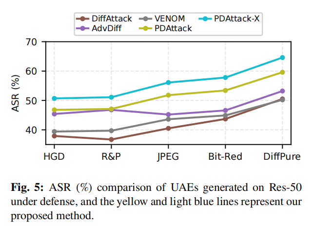

## PDAttack Neural Networks
 
   The code repository for our paper PDAttack: Enhancing Transferability of Unrestricted Adversarial Examples via Prompt-Driven Diffusion.
## Overview
<div>
  
</div>
   
If the image doesn't display properly, you can click [here](fig/Overview.png) to view our framework.
## Requirements

1. Hardware Requirements
    - GPU: 1x high-end NVIDIA GPU with at least 24GB memory
    - Memory: At least 40GB of storage memory

2. Software Requirements
    - Python: 3.10
    - CUDA: 12.2

   To install other requirements:

   ```bash
   pip install -r requirements.txt
   ```
3. Datasets
   - Please download the dataset [ImageNet-Compatible](https://github.com/cleverhans-lab/cleverhans/tree/master/cleverhans_v3.1.0/examples/nips17_adversarial_competition/dataset) and then change the settings of `--images_root` and `--label_path` in [main.py](main.py)

4. Pre-trained Models
   - We adopt [Stable Diffusion 2.1](https://huggingface.co/stabilityai/stable-diffusion-2-1-base) as our diffusion model, you can download and load the pretrained weight by setting `--pretrained_diffusion_path="stabilityai/stable-diffusion-2-1-base"` in [main.py](main.py). You can download them from here.
   - Other models used are [BLIP-2](https://huggingface.co/Salesforce/blip2-opt-2.7b), [MiniGPT-4](https://huggingface.co/Vision-CAIR/MiniGPT-4), and [LLaVA-1.5](https://huggingface.co/liuhaotian/llava-v1.5-7b). You can download them from here.

## Perturbation Prompts Generation
1. We provide the code for the perturbation prompts generation by BLIP-2. Other generative models are similar.  You can run the following code to generate prompts.
   ```bash
   python prompt_BLIP2.py
   ```

## Crafting Unrestricted Adversarial Examples
1. We provide the code for the craft unrestricted adversarial examples. You can view our code to see how our method is implemented. You can run the following code to generate it.
   ```bash
   python main.py
   ```
## Evaluation
   
1. We here provide unrestricted adversarial examples crafted for Res-50 using our method and its enhanced version. We store them in .[/output](output). Simply run eval_attack.py to perform attacks against the official PyTorch ResNet50 model. You can modify the attack parameter at the [eval_attack.py](eval_attack.py).  
   
   - For eval attack, please run:

   ```bash
   python eval_attack.py
   ```

2. You can also run eval_fid.py to get the evaluated FID result.

   - For eval FID, please run:

   ```bash
   python eval_fid.py
   ```

3. You can also run eval_iqa.py to get the evaluated SSIM, PSNR and LPIPS results.

   - For eval SSIM, PSNR and LPIPS, please run:
   
   ```bash
   python eval_iqa.py 
   ```
## Results
<div>
  
</div>

<div>
  
</div>

<div>
  
</div>

<div>
  
</div>

<div>
  
</div>

<div>
  
</div>